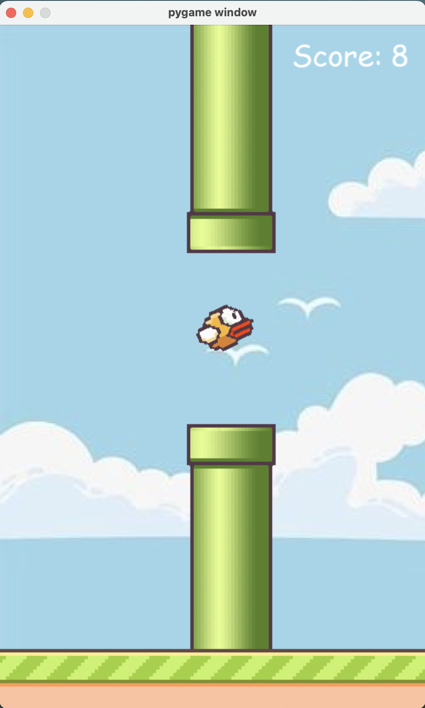

# CodeWing-Neural-Navigation-using-AI

Welcome to CodeWing, an evolutionary twist on the Bird game, where birds learn to navigate through pipes using NeuroEvolution of Augmenting Topologies (NEAT) algorithm.

## Overview

This project implements the Bird game using the Pygame library and integrates NEAT for training an AI to play the game. Instead of manually designing the behavior of the birds, NEAT evolves neural networks to control the bird's actions, allowing them to learn and improve over time.

## Features

- **NEAT Integration:** Utilizes NEAT, a genetic algorithm for evolving neural networks, to train birds to play the game.
- **Dynamic Gameplay:** Experience dynamic gameplay as the birds evolve their strategies to navigate through pipes.
- **Scalable Population:** Easily configure the population size and other NEAT parameters to customize the evolutionary process.
- **Visual Feedback:** Visualize the progress of the evolving birds through the game window, displaying the current score and generation.

## Getting Started

### Prerequisites

Ensure you have the following installed:

- Python (3.x recommended)
- Pygame library
- NEAT library

### Installation

1. Clone the repository:
    ```
    git clone https://github.com/nimisha218/CodeWing-Neural-Navigation-using-AI.git
    ```


3. Install dependencies:
    ```
    pip install -r requirements.txt
    ```

### Usage

Run the main script to start the game:
    ```
    python code_wing.py
    ```

Watch as the birds evolve and learn to play the game!

## Working Sample



## Configuration

You can customize the NEAT algorithm parameters by modifying the `config-feedforward.txt` file. Experiment with different settings to observe how they affect the learning process and bird behavior.

